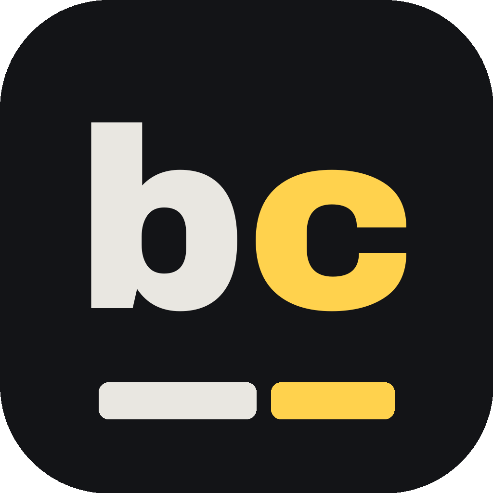
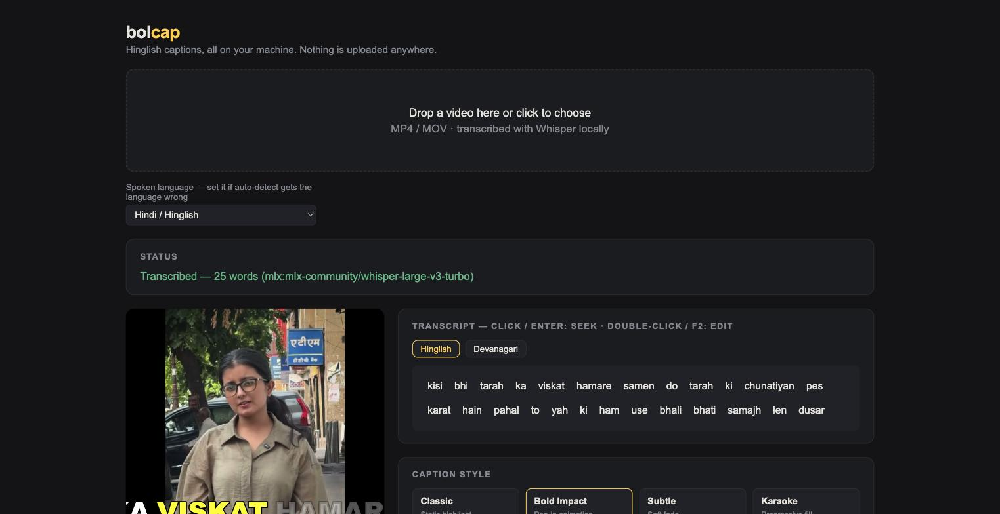

# BolCAP

Turn long videos into viral short-form clips with animated Hinglish captions.


Two products live in this repo:

1. **Clipper** — paste a YouTube URL or upload a video, Gemini finds the 3-5 most viral moments, and each one is rendered as a vertical 9:16 clip with blur-pad background, face-aware cropping, and burned word-by-word captions.
2. **Bolcap** — a transcribe → edit → render caption pipeline for editors ("bol" = speak, + captions). Word-level Whisper transcription (Hindi/English code-switched speech supported), natural Hinglish romanization, fully customizable caption styles (fonts, colors, animations), and editor-friendly exports including transparent alpha overlays for Premiere/Final Cut/Resolve. Ships two ways: a hosted web app, and a **free cross-platform desktop app — see [BOLCAP.md](BOLCAP.md) to download and install it**.

The GIF is real output: word-by-word Hinglish captions with the spoken word
highlighted, burned by the engine in this repo.

All technical choices and their rationale live in [DECISIONS.md](DECISIONS.md).

<br clear="right">

## Structure

```
backend/            FastAPI service
  main.py           API: auth, clip jobs, upload/URL processing
  clipper.py        download → Gemini viral-moment analysis → parallel clip rendering
  captions/         Bolcap caption engine (SaaS API + CLI)
    styles.py       CaptionStyle schema — the user-facing customization surface
    transcribe.py   Whisper word timestamps (mlx-whisper → faster-whisper → openai-whisper)
    romanize.py     Devanagari → natural Hinglish (LLM pass with rule-based fallback)
    engine.py       word timings + style → animated ASS subtitles
    render.py       exports: burned MP4, alpha overlay .mov, .ass, .srt
    tighten.py      finds dead air, filler words, and stutters worth cutting
    retakes.py      finds lines delivered more than once, picks the keeper
    timeline.py     cuts as an EDL / FCPXML timeline (no re-encode)
    llm.py          one cloud call over plain HTTP, no SDK (retakes only)
    storage.py      durable jobs + Supabase Storage (signed uploads, retention cleanup)
    notify.py       completion notifications (in-app feed + Resend email)
    api.py          /captions/* routes
    cli.py          local end-to-end runs, no server needed
    schema.sql      caption_jobs table + captions bucket (run once in Supabase)
  supabase_client.py  auth + clip storage (signed URLs, TTL cleanup)
frontend/           Next.js app (Supabase auth, clip dashboard)
```

## Bolcap caption engine

### The desktop app

Drop in a video, and everything happens on your machine. Whisper transcribes it,
the words are romanized into natural Hinglish, and you get a transcript you can
correct word by word plus a live caption preview over your own footage.



Click any word to jump the video there, double-click to retype it, then style
the captions and export — burned into an MP4, or as a transparent overlay `.mov`
for your editing timeline. [Download and install it →](BOLCAP.md)

### Tighten

Bolcap can find the parts of a take worth cutting: dead air, filler words, and
stutters. Cuts show up on a timeline you can argue with — click a greyed span to
bring it back, and playback skips whatever is still removed.

Filler detection does not work off a word list. In a real 757-word transcript,
every occurrence of "toh", "na", "haan", and "yaani" was doing grammatical work,
so a list-matching cutter would have deleted seven real words and scored 0%
precision. Instead, sounds with no lexical meaning ("umm", "uh", "hmm") are cut
on sight, and real words that are *sometimes* fillers are scored on context and
left alone by default. The reasoning is in [DECISIONS.md](DECISIONS.md), and
`scripts/eval_tighten.py` runs in CI on every push, failing the build if any
real word gets cut.

**Fit to length** takes a target — "1:00" — and applies the least doubtful cuts
needed to reach it, dropping any it turns out not to need. If the target is out
of reach it says by how much rather than quietly handing back something longer.
It never applies a retake to hit a number.

Cuts leave two ways. A flattened MP4 with the captions burned on, or an **EDL /
FCPXML timeline** that carries the cuts into Premiere, Resolve, or Final Cut and
relinks your original file, so nothing is re-encoded and every cut stays
draggable. In FCPXML, cuts you turned down travel along as markers; EDL has no
way to carry them.

### Retakes

The other big time sink is a line delivered three times until it comes out
right. Bolcap groups the attempts, picks the keeper, and shows them side by
side so you can play each one before cutting anything.

Cheap local arithmetic does the finding: split the transcript at real pauses,
score each phrase against the recent ones. Only what survives goes to a cloud
model, about one call per minute of video, and the model only ever *chooses*
between spans that were already measured — it proposes no timestamps and
rewrites no text, so a bad answer cannot invent a cut inside a good sentence.

This is the one feature that leaves your machine, and only with a key set.
Paste one into the Retakes panel in the app, or set it in the environment for
CLI runs:

```bash
export ANTHROPIC_API_KEY=...      # or GOOGLE_API_KEY
```

A key pasted in the app is stored in `~/.bolcap/config.json`, readable by your
user account alone, and never leaves the machine. An environment variable wins
over it.

Your **transcript text** is sent. Audio and video never are. Retakes never apply
themselves — a wrong retake cut removes seconds of real speech, so every one
waits for you.

### Flow

1. **Transcribe** — Whisper with word timestamps.
2. **Romanize** — Devanagari → natural Hinglish, alignment preserved.
3. **Tighten** (optional) — find dead air, fillers, and stutters, and cut them.
   Retake detection lives here too, behind an API key.
4. **Style** — a `CaptionStyle` JSON or a preset (`default`, `bold_impact`, `subtle`, `karaoke`).
5. **Export** — `burned` MP4, `overlay` alpha .mov, `ass`, `srt`, or an `edl` / `fcpxml` timeline.

### CLI

```bash
cd backend
python -m captions.cli video.mp4                          # transcribe + burn, bold_impact style
python -m captions.cli video.mp4 --export overlay         # alpha overlay for editors
python -m captions.cli video.mp4 --style my_style.json    # custom style JSON
python -m captions.cli video.mp4 --transcript saved.json  # reuse a transcript, skip Whisper

python -m captions.cli video.mp4 --tighten-report          # what would be cut, and why
python -m captions.cli video.mp4 --tighten                 # cut it, captions re-timed to match
python -m captions.cli video.mp4 --tighten --export fcpxml # cuts to your NLE, no re-encode
python -m captions.cli video.mp4 --tighten --fit 1:00      # trim to a target length
python -m captions.cli video.mp4 --retakes                 # report repeated lines
python -m captions.cli video.mp4 --tighten --cut-retakes   # and remove them
```

Transcripts are saved next to the video (`*_transcript.json`) so re-styling never re-transcribes.

### API

```
POST /captions/upload-url          signed direct-to-storage upload URL for big videos
POST /captions/transcribe          audio/video (file or storage_path) → transcript job
GET  /captions/presets             built-in style presets
GET  /captions/style-schema        JSON schema for building a style-editor UI
POST /captions/render              transcript + style + export → render job (email on finish)
GET  /captions/jobs                my jobs
GET  /captions/jobs/{id}           job status + transcript
GET  /captions/download/{id}       redirect to signed download URL
GET  /captions/notifications       unseen finished jobs (bell badge)
POST /captions/notifications/seen  mark feed items read
```

All `/captions/*` routes require a Supabase bearer token (same auth as the clipper).

## Clipper

`POST /process-url` or `POST /upload` with optional `instructions`, `clip_style` (funny / educational / emotional / controversial / highlights) and `caption_style`. Jobs run in the background; poll `GET /status/{job_id}`. Finished clips upload to Supabase Storage with signed URLs and a 6-hour TTL.

## Setup

```bash
# backend
cd backend
pip install fastapi uvicorn supabase yt-dlp google-generativeai moviepy \
            faster-whisper indic-transliteration pydantic python-multipart requests
pip install mlx-whisper     # Apple Silicon only, much faster transcription
pip install openai-whisper  # optional legacy fallback, pulls PyTorch
uvicorn main:app --reload

# frontend
cd frontend
npm install && npm run dev
```

One-time: run `backend/captions/schema.sql` in the Supabase SQL editor (creates the `caption_jobs` table and `captions` bucket).

Requires `ffmpeg` on PATH.

Environment:

| Variable | Purpose |
|---|---|
| `SUPABASE_URL`, `SUPABASE_SERVICE_KEY` | auth, storage, job rows |
| `GOOGLE_API_KEY` | Gemini (clip analysis + Hinglish romanization) |
| `CAPTION_RETENTION_SECONDS` | file/job lifetime, default 172800 (48h) |
| `RESEND_API_KEY`, `CAPTION_FROM_EMAIL` | completion emails (optional — skipped if unset) |
| `APP_URL` | link target in notification emails |
| `CAPTION_STALE_SECONDS` | orphaned-job timeout, default 1800 |

## License

Apache License 2.0 — see [LICENSE](LICENSE) and [NOTICE](NOTICE).

ffmpeg is not redistributed here. The desktop app downloads official
prebuilt binaries into the user's own machine on first run (or uses the
ones already on their PATH) and calls them as separate programs, so their
GPL terms cover those binaries rather than this source. NOTICE has the
details.
